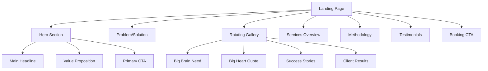
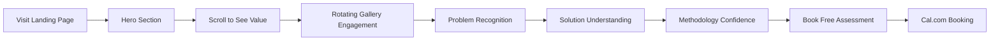

# BigBrainBusiness.de - Modern Animated Landing Page UI/UX Specifications

## 1. Introduction

### Project Context
AI-augmented consulting practice landing page combining "big brain + big heart" philosophy with modern, animated user experience. The page serves German SMBs seeking premium consulting services while showcasing AI expertise through design execution.

### UX Goals
- **Convert visitors to consultations** through clear value proposition and frictionless booking
- **Establish credibility** via professional design reflecting AI expertise
- **Differentiate from competitors** through modern animations and interactions
- **Build trust** through authentic messaging and human-centered approach

### Target User Personas
**Primary: German SMB Decision Makers**
- Age: 35-55, established business owners
- Budget: €3K-15K project capacity
- Pain: Need strategic guidance but skeptical of AI hype
- Goal: Find reliable, results-driven consulting partner

**Secondary: Tech-Savvy Startups** 
- Age: 25-40, founders and CTOs
- Budget: €5K-25K project capacity  
- Pain: Generic AI outputs lack implementation detail
- Goal: Systematic methodology for AI-enhanced development

### Design Principles
1. **Authentic Intelligence** - Show, don't just tell about AI capabilities
2. **Human Warmth** - Balance tech sophistication with approachable personality
3. **Systematic Trust** - Visual hierarchy reflecting methodical approach
4. **Premium Quality** - Design quality justifying €150-250/hour rates

## 2. Information Architecture

### Site Map


### Navigation Structure
- **Fixed header**: Logo, "Über uns", "Leistungen", "Kontakt", "Termin buchen"
- **Smooth scroll**: All navigation anchors to page sections
- **Mobile**: Hamburger menu with slide-out navigation

## 3. User Flows

### Primary Conversion Flow


### Mobile Experience Flow
- **Thumb-friendly** button sizes (minimum 44px)
- **Swipe gestures** for gallery navigation
- **Progressive disclosure** of information to prevent overwhelm

## 4. Hero Section with Rotating Gallery

### Gallery Content Rotation
**Slide 1: Big Brain Introduction**
- Background: Dark tech aesthetic with neural network patterns
- Headline: "Wo Big Brains auf Big Hearts treffen"
- Subtext: "KI-Intelligenz mit menschlicher Führung für deutsche Unternehmen"
- Visual: Abstract brain-heart hybrid with blue-orange gradient

**Slide 2: Shadow IT Security Risk**
- Background: 3D abstract visualization - secure data streams (blue) flowing into dark void (59% unauthorized)
- Headline: "Datenlecks durch öffentliche KI-Tools"
- Subtext: "Mitarbeitende nutzen ChatGPT & Co. mit sensiblen Unternehmensdaten – ein kritisches Sicherheitsrisiko."
- Visual: Abstract 3D particle streams showing data breach, LinkedIn blue → darkness with orange warning accents
- Style: Matches gallery aesthetic - smooth gradients, professional depth, conceptual/symbolic
- CTA: "Datensicherheit besprechen" linking to booking section

**Slide 3: Systematic AI Integration**
- Background: Split screen showing chaos vs order
- Headline: "Systematische KI-Integration ohne Hype"
- Subtext: "Richtig gemacht kann KI Ihnen 95% Ihrer Zeit bei spezifischen Aufgaben sparen."
- Visual: Before/after comparison graphics

**Slide 4: AI Augmentation Philosophy**
- Background: Hybrid visualization showing human + AI collaboration
- Headline: "Was kann KI für Sie tun?"
- Subtext: "KI-Agenten entwickelt, um Sie zu unterstützen, nicht um Sie zu ersetzen."
- Visual: Abstract representation of hybrid model

**Slide 5: Data Security & GDPR Trust**
- Background: 3D security shield with German/European compliance elements
- Headline: "Ihre Daten bleiben Ihre - Sicherheit garantiert"
- Subtext: "Deutsche Standards und europäische Sicherheit - Ihre Daten sind bei uns sicher"
- Visual: Professional 3D shield with GDPR symbols, EU flag, padlocks

### Gallery Mechanics
- **Auto-rotation**: 6-second intervals with pause on hover
- **Manual controls**: Dots navigation and arrow controls
- **Smooth transitions**: 800ms crossfade with easing
- **Progress indicator**: Animated progress bar for current slide

## 5. Comparison Section - Best Path to Goals

### Section Title & Philosophy
- **Main Title**: "Der beste Weg zu Ihren Zielen" (The Best Path to Your Goals)
- **Subtitle**: "Es geht nicht nur um KI-Tools, sondern um Prozessverständnis und die richtige Werkzeugwahl"
- **Core Message**: "Ein großes Gehirn ohne Herz könnte das Ziel verfehlen. Ein großes Herz ohne Gehirn findet möglicherweise nicht die Lösung."

### Three-Column Comparison Layout

**Column 1: Traditional Consultancy**
- **Title**: "Traditionelle Beratung" (centered)
- **Subtitle**: "Bewährte Methoden" (centered)
- **Benefits**:
  - Bewährte Arbeitsabläufe und Prozesse
  - Echte empathische menschliche Kommunikation und Analyse
  - Tiefe Fachexpertise
- **Drawbacks**:
  - Benötigt mehr Zeit
  - Höhere Kosten durch Zeitaufwand

**Column 2: Standard AI Tools**
- **Title**: "Standard KI-Tools" (centered)
- **Subtitle**: "Schnell und zugänglich" (centered)
- **Benefits**:
  - Große Community
  - Macht Spaß zu verwenden
  - Schnelle erste Ergebnisse
- **Drawbacks**:
  - 65% der Ergebnisse sind nicht verwendbar
  - Oberflächliche Analyse

**Column 3: Hybrid Approach**
- **Title**: "Human Excellence + AI Efficiency" (centered)
- **Subtitle**: "Das Beste aus beiden Welten" (centered)
- **Benefits**:
  - Qualität durch Human-in-the-Loop
  - 95% Zeitersparnis bei spezifischen Aufgaben
  - Günstiger und skalierbar
  - Beratung wird richtig und schneller gemacht

### Animation Specifications
- **Card Hover Effects**: Scale animation (zoom in/out) instead of floating up/down
- **Icon Animation**: Only icons float up/down, not entire cards
- **Consistent Heights**: All three cards maintain equal height
- **Smooth Transitions**: Use transform: scale() for card interactions

## 6. Component Library

### Primary Button (Liquid Effect)
```css
.liquid-button {
  position: relative;
  background: linear-gradient(45deg, #00D4FF, #FF6B35);
  border-radius: 50px;
  padding: 1rem 2rem;
  overflow: hidden;
  transition: transform 0.3s ease;
}

.liquid-button::before {
  content: '';
  position: absolute;
  top: -50%;
  left: -50%;
  width: 200%;
  height: 200%;
  background: radial-gradient(circle, rgba(255,255,255,0.3) 0%, transparent 70%);
  transform: scale(0);
  transition: transform 0.5s cubic-bezier(0.25, 0.46, 0.45, 0.94);
}

.liquid-button:hover::before {
  transform: scale(1);
}

.liquid-button:hover {
  transform: translateY(-2px);
  box-shadow: 0 10px 30px rgba(0, 212, 255, 0.4);
}
```

### Blob Animation Cards
- **Morphing shapes** behind service cards on hover
- **Color transitions** matching brand gradient
- **Performance optimized** using CSS transforms only

## 6. Branding & Style Guide

### Color Palette
```css
:root {
  /* Primary Brand Colors from LinkedIn Banner */
  --brain-blue: #00D4FF;      /* Left side - intelligence */
  --heart-orange: #FF6B35;    /* Right side - humanity */
  --deep-navy: #1A1A1A;       /* Professional base */
  --pure-white: #FFFFFF;      /* Clarity and space */
  
  /* Secondary Colors */
  --success-green: #27AE60;   /* Achievement indicators */
  --warning-amber: #F39C12;   /* Attention elements */
  --subtle-gray: #64748B;     /* Secondary text */
  --light-gray: #F8FAFC;      /* Background sections */
}
```

### Typography Scale
- **Headings**: Inter, 700 weight, geometric precision
- **Body text**: -apple-system fallback stack, 400/500 weight
- **Scale**: 1.25 ratio (16px base, 20px, 25px, 31px, 39px, 49px)

### Iconography
- **Style**: Outlined, 2px stroke weight
- **Library**: Heroicons or custom SVG
- **Animation**: Subtle scale/rotate on interaction

## 7. Animation Specifications

### Scroll-Triggered Animations
**Entrance Animations (Intersection Observer)**
```javascript
// Elements fade up as they enter viewport
.fade-up-on-scroll {
  opacity: 0;
  transform: translateY(30px);
  transition: all 0.6s cubic-bezier(0.25, 0.46, 0.45, 0.94);
}

.fade-up-on-scroll.in-view {
  opacity: 1;
  transform: translateY(0);
}
```

**Stagger Effects**
- Service cards: 100ms delay between each
- Statistics: 150ms delay with number counting animation
- Process steps: 200ms delay with icon animations

### Micro-interactions
**Button Hover States**
- Liquid blob expansion (0.5s duration)
- Elevation change (-2px transform)
- Color saturation increase
- Subtle glow effect

**Card Interactions**
- Scale increase (1.02x) on hover
- Shadow depth animation
- Border color transition
- Internal content shift

### Performance Considerations
- **GPU acceleration** for all animations (transform/opacity only)
- **Reduced motion** respect for accessibility
- **60fps target** for all interactions

## 8. Responsive Strategy

### Breakpoints
- **Mobile**: 320px - 767px
- **Tablet**: 768px - 1023px  
- **Desktop**: 1024px+
- **Large**: 1400px+ (centered max-width)

### Hero Gallery Adaptations
**Mobile (320-767px)**
- Single column layout
- Larger touch targets (44px minimum)
- Swipe gestures for gallery navigation
- Reduced animation complexity

**Tablet (768-1023px)**
- Two-column service sections
- Maintained hover effects
- Hybrid touch/mouse interactions

**Desktop (1024px+)**
- Full multi-column layouts
- Rich hover animations
- Cursor-based interactions

## 9. Accessibility Requirements

### WCAG 2.1 AA Compliance
- **Color contrast**: 4.5:1 minimum for text
- **Focus indicators**: 2px blue outline on all interactive elements
- **Motion sensitivity**: Respect prefers-reduced-motion
- **Keyboard navigation**: Full tab order and skip links

### Screen Reader Support
- Semantic HTML structure
- ARIA labels for complex interactions
- Alt text for all imagery
- Heading hierarchy (h1 → h6)

### Gallery Accessibility
- Pause/play controls for auto-rotation
- Keyboard arrow navigation
- Screen reader announcements for slide changes
- Alternative text for all slide content

## 10. Performance Targets

### Core Web Vitals
- **LCP (Largest Contentful Paint)**: < 2.5s
- **FID (First Input Delay)**: < 100ms
- **CLS (Cumulative Layout Shift)**: < 0.1

### Optimization Strategies
- **Image optimization**: WebP format with fallbacks
- **Critical CSS**: Inline above-the-fold styles
- **Lazy loading**: Gallery images and below-fold content
- **Bundle optimization**: Tree-shaking and code splitting

## 11. Technical Implementation Notes

### Animation Libraries
- **Framer Motion**: React-based animations with performance optimization
- **GSAP**: Complex timeline animations if needed
- **CSS-only fallbacks**: For critical interactions

### Gallery Implementation
```javascript
// Intersection Observer for scroll animations
const observerOptions = {
  threshold: 0.1,
  rootMargin: '0px 0px -50px 0px'
};

const observer = new IntersectionObserver((entries) => {
  entries.forEach(entry => {
    if (entry.isIntersecting) {
      entry.target.classList.add('in-view');
    }
  });
}, observerOptions);
```

### Liquid Button Implementation
- CSS custom properties for dynamic theming
- JavaScript event listeners for advanced interactions
- Performance monitoring for smooth 60fps

## 12. Content Strategy

### Hero Messaging Hierarchy
1. **Primary headline**: "Wo Big Brains auf Big Hearts treffen"
2. **Value proposition**: Systematic AI methodology delivering 90% usable results
3. **Social proof**: Client success metrics and testimonials
4. **Clear CTA**: Free assessment booking with immediate value

### Gallery Story Arc
- **Problem awareness**: Current AI limitations
- **Solution introduction**: Systematic methodology
- **Proof points**: Client success stories  
- **Action step**: Booking interface

## 13. Testing Strategy

### User Testing
- **A/B test**: Gallery auto-rotation vs. manual control preference
- **Heat mapping**: Button placement and interaction patterns
- **Conversion tracking**: Booking completion rates

### Technical Testing
- **Cross-browser**: Chrome, Firefox, Safari, Edge
- **Device testing**: iPhone, Android, tablet, desktop
- **Performance auditing**: Lighthouse, Web Vitals
- **Accessibility scanning**: aXe, WAVE tools

## 14. Success Metrics

### Primary KPIs
- **Conversion rate**: Visitor to booking (target: 5-8%)
- **Engagement time**: Average session duration (target: 2+ minutes)
- **Bounce rate**: Single-page exits (target: <60%)
- **Mobile performance**: Mobile vs desktop conversion parity

### Design Quality Indicators
- **Animation smoothness**: 60fps maintenance
- **Load performance**: Core Web Vitals scores
- **User feedback**: Qualitative design feedback
- **Brand alignment**: Professional perception surveys

This comprehensive specification ensures your landing page will deliver a modern, animated experience that converts visitors while maintaining the premium positioning of BigBrainBusiness.de.